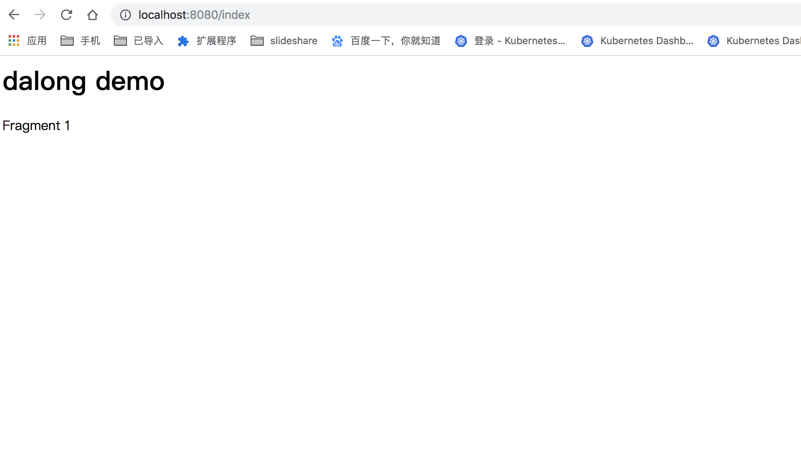
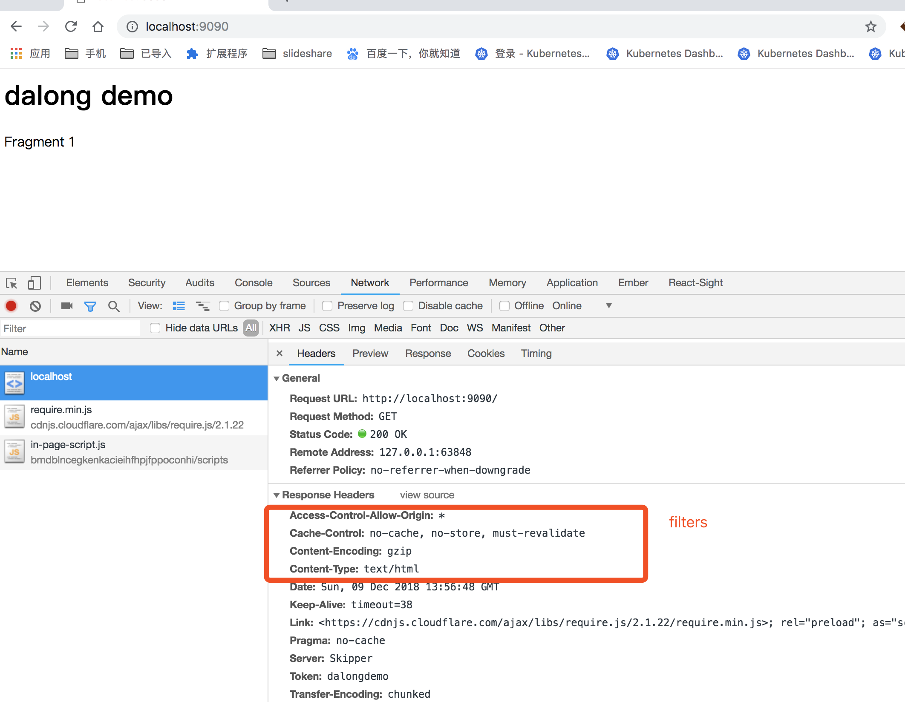
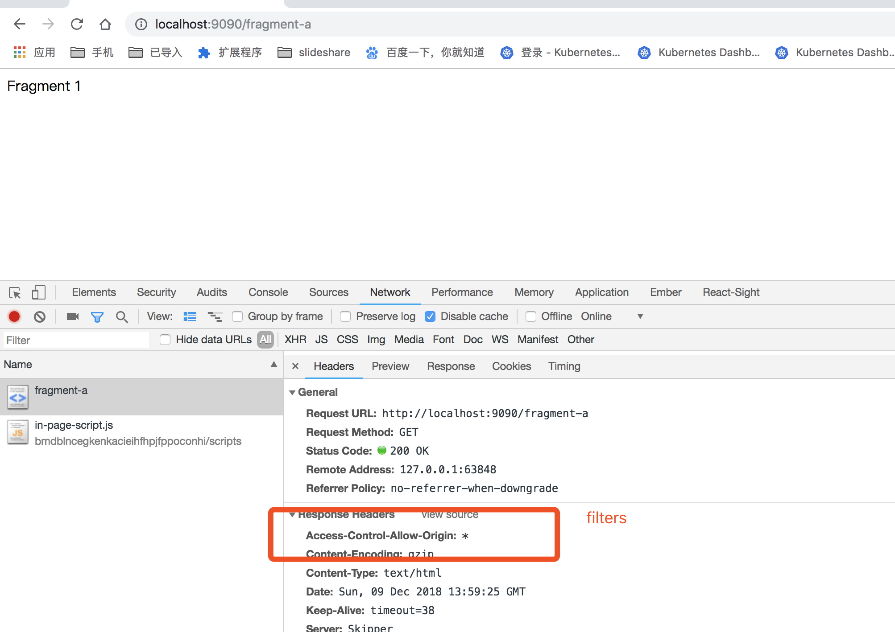

# use tailor with skipper

use docker-compose for running

## how to run

* build image

```code
docker-compose build
```

* runing

```code
docker-compose up -d
```

* view result

```code
open http://localhost:9090

or 

open  http://localhost:8080/index

fragment page

open http://localhost:9090/fragment-a
```

## some images



